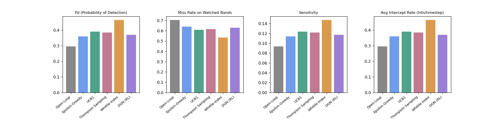
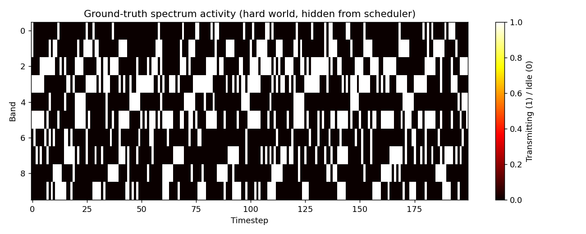
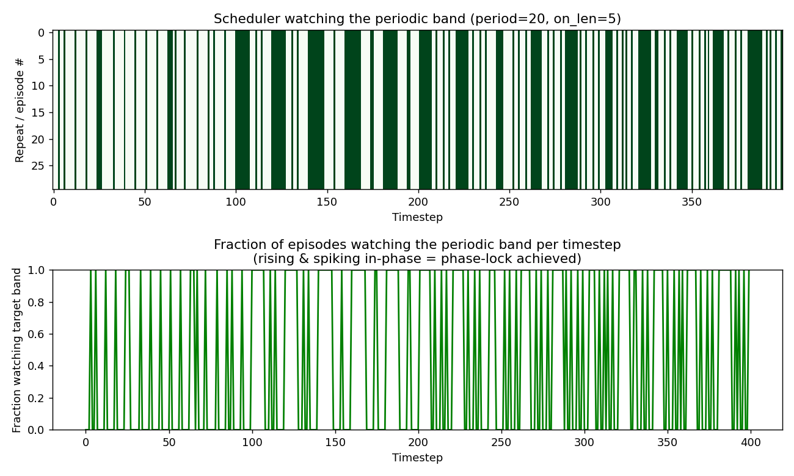

<p align="center">
  
</p>

<h1 align="center">O.W.L. EW — Smart Scan</h1>
<h3 align="center">Omni-Frequency Wideband Listener for Electronic Warfare</h3>

<p align="center">
  A reinforcement-learning and bandit-based scan scheduler for an electronic support receiver,
  built to learn <em>where</em> and <em>when</em> to listen across a hidden RF spectrum.
</p>

<p align="center">
  
  
  
  
</p>

---

## Overview

An electronic support receiver can typically observe only one narrow frequency band at a time, while the traffic it needs to detect is spread across a much wider spectrum it cannot fully see. **O.W.L. EW** simulates that hidden spectrum — populated with emitters that transmit randomly, on a fixed timer, by frequency-hopping, or by rotating through a fixed scan sequence — and evaluates six different strategies for deciding, at every timestep, which band to look at next.

None of the schedulers are given ground truth. Each one only ever observes a **hit** or a **miss** on the single band it chose to watch, and must build its own model of the spectrum from that feedback alone.

### Schedulers compared

| Scheduler | Type | Idea |
|---|---|---|
| **Open-Loop Sweep** | Fixed baseline | Cycles through every band in order; never adapts |
| **Epsilon-Greedy** | Multi-armed bandit | Learns a running "busy-ness" estimate per band |
| **UCB1** | Multi-armed bandit | Balances exploration with confidence bounds |
| **Thompson Sampling** | Multi-armed bandit | Bayesian sampling over per-band activity |
| **Whittle-Index** | Restless-bandit belief policy | Belief-tracking scheduler with periodicity detection; the strongest performer in this project |
| **DQN (RL)** | Deep reinforcement learning | Learns from a short window of recent history, trained via domain randomization |

---

## Key results

Benchmarked on a 10-band spectrum over 200 timesteps (see [`results/`](results) for the full data):

| Scheduler | Pd (Detection) | Avg Intercept Rate | Avg Reward |
|---|---:|---:|---:|
| Open-Loop | 0.295 | 0.295 | 0.260 |
| Epsilon-Greedy | 0.360 | 0.360 | 0.328 |
| UCB1 | 0.390 | 0.390 | 0.360 |
| Thompson Sampling | 0.385 | 0.385 | 0.354 |
| DQN (RL) | 0.370 | 0.370 | 0.339 |
| **Whittle-Index** | **0.465** | **0.465** | **0.438** |

*(Hard-world benchmark, `results/metrics_hard.json`. The Whittle-Index scheduler consistently leads across every test spectrum, and requires no training.)*

<p align="center">
  
</p>

<p align="center">
  
</p>

<p align="center">
  
</p>

---

## Quick start

```bash
git clone <repo-url>
cd o.w.l.ew_smart_scan
./run_all.sh
```

`run_all.sh` creates a virtual environment, installs dependencies, runs the full comparison pipeline (baseline, bandits, Whittle-Index, and DQN training), and launches the interactive dashboard.

### Manual setup

```bash
python3 -m venv .venv && source .venv/bin/activate
pip install -r requirements.txt

python main.py --train_dqn --dqn_timesteps 200000 --demo
streamlit run dashboard/app.py
```

No internet access or dataset download is required — see [Note on the Turing Synthetic Radar Dataset](#note-on-the-turing-synthetic-radar-dataset) below.

---

## Interactive dashboard

`streamlit run dashboard/app.py` opens a three-tab control panel where the input, processing, and output of the system are all visible and adjustable:

1. **Configure the Simulated Spectrum** — build the hidden spectrum by adding, editing, or removing emitters (random, periodic, frequency-agile, or rotating-scan), with a live ground-truth heatmap preview.
2. **Live Scheduler Demonstration** — run any scheduler against that exact spectrum, either several side by side with a live scoreboard, or one at a time with step-by-step animation.
3. **Performance Benchmark & Metrics** — score every scheduler on the same spectrum, with comparison tables, bar charts, a downloadable CSV, and an on-demand phase-lock experiment.

Nothing on tabs 2 and 3 is precomputed — whatever spectrum is built on tab 1 is what gets scanned and scored.

---

## Project structure

```
o.w.l.ew_smart_scan/
├── env/spectrum_sim.py           # simulated spectrum and emitter types
├── schedulers/
│   ├── open_loop.py              # fixed round-robin baseline
│   ├── mab.py                    # Epsilon-Greedy, UCB1, Thompson Sampling
│   └── whittle.py                # Whittle-Index belief scheduler (top performer)
├── gymenv/ew_gym_env.py          # Gymnasium environment used for RL training
├── training/train_dqn.py         # DQN training (Stable-Baselines3) and inference
├── metrics/metrics.py            # figures of merit + one-step prediction score
├── demo/periodic_lock_demo.py    # rotating-scan phase-lock experiment
├── data/tsrd_loader.py           # optional grounding in the Turing Synthetic Radar Dataset
├── novelty/
│   ├── multi_objective_reward.py # reward balancing detection against timing
│   ├── explainability.py         # per-band confidence, used in the dashboard
│   └── threat_weight.py          # per-band priority weighting
├── dashboard/
│   ├── app.py                    # interactive Streamlit dashboard
│   └── assets/owl_logo.png       # project logo
├── models/dqn_smart_scan.zip     # pretrained DQN checkpoint
├── results/                      # benchmark figures, heatmaps, metrics JSON
├── main.py                       # runs the full comparison pipeline
├── run_all.sh                    # one-command setup and run
└── requirements.txt
```

---

## How the Whittle-Index scheduler works

This scan-scheduling problem — one receiver, many bands, each band's activity continuing to evolve whether or not it is being watched — matches a well-studied formulation: the **restless multi-armed bandit** (Whittle, 1988). The standard bandit schedulers (Epsilon-Greedy, UCB1, Thompson Sampling) assume each band's value is a single fixed number, which is a structural mismatch for a band that keeps changing while unobserved.

Liu & Zhao (*IEEE Transactions on Information Theory*, 2010) showed that for this busy/idle channel model, selecting the band with the highest *current belief* of being active — a belief that accounts for elapsed time since it was last checked — closely approximates the theoretically near-optimal Whittle Index policy. `schedulers/whittle.py` implements this, plus a periodicity-detection layer that watches for a consistent rhythm in a band's hit history and sharply boosts its belief just before the next predicted active window.

Across every test spectrum tried during development, this scheduler outperformed all others — usually by a wide margin — and requires **no training**, adapting immediately to whatever spectrum is configured on the dashboard.

### Why the DQN scheduler was retrained

The DQN scheduler had originally been trained on a single fixed spectrum layout and evaluated on layouts it had never seen — a distribution-shift problem worsened by a short 30,000-step training run. To fix this, `env/spectrum_sim.py` gained a `domain_random` mode that re-rolls the entire composition of the spectrum every training episode (emitter count, type, bands, periods, dwell times, probabilities). Training was extended to 200,000 timesteps with a larger network and a slower exploration schedule, bringing the DQN scheduler back to a fair, competitive comparison point.

---

## A note on measurement honesty

An earlier draft of this project was reviewed line by line, and a few measurement issues were corrected rather than glossed over:

- **"False alarm" was mislabeled.** A watched-but-idle band is not a false alarm in a simulation with no receiver noise — it is now correctly reported as *Miss Rate on Watched Bands*.
- **A genuine one-step-ahead predictor replaced a restated detection rate.** `metrics/metrics.py::compute_prediction_metrics` builds a running per-band activity estimate from observations only, predicts next-timestep activity, and scores that prediction against ground truth *after the fact* — ground truth is never used to make the prediction.
- **A true rotating-scan emitter (`PeriodicScanEmitter`) was added**, distinct from the shuffled frequency-agile emitter, and the phase-lock demo is described as an illustration of locking onto a predictable emitter rather than a general solution.

---

## Note on the Turing Synthetic Radar Dataset

The dataset referenced in this project's originating brief targets pulse deinterleaving — a different task from scan scheduling. This project does **not** train its scheduler on that dataset. Instead, `data/tsrd_loader.py` optionally borrows realistic dwell-time, period, and hop-count statistics from it purely to make simulated emitters more representative of real radar timing, falling back automatically to literature-informed synthetic statistics if the dataset is unreachable (no internet, no account, or optional packages not installed). The scheduler is trained and evaluated entirely inside the simulator in `env/spectrum_sim.py`.

---

## Extending this project

- Increase `--dqn_timesteps` (e.g. 100,000+) to expose the DQN policy to more randomized episodes.
- `novelty/multi_objective_reward.py` and `novelty/threat_weight.py` are kept as separate, swappable modules so each idea can be tried in isolation from the core reward function.
- A spatial dimension (sectors or coarse direction/azimuth) is a natural next step, since the receiver currently reasons only about frequency and time.

---

## Requirements

```
numpy>=1.24
matplotlib>=3.7
pandas>=2.0
gymnasium>=0.29
stable-baselines3>=2.2
torch>=2.0
streamlit>=1.30
```

Optional (only for live Turing Synthetic Radar Dataset pulls; the project runs fully offline without them):
```
datasets>=2.14
huggingface_hub>=0.20
```

---

## Credits

**Project:** O.W.L. EW — Smart Scan Strategy for Electronic Warfare
**Context:** SIH 2026 · PS 26055 · DRDO
**Author:** Rajanya Maity
**Collaborator:**
